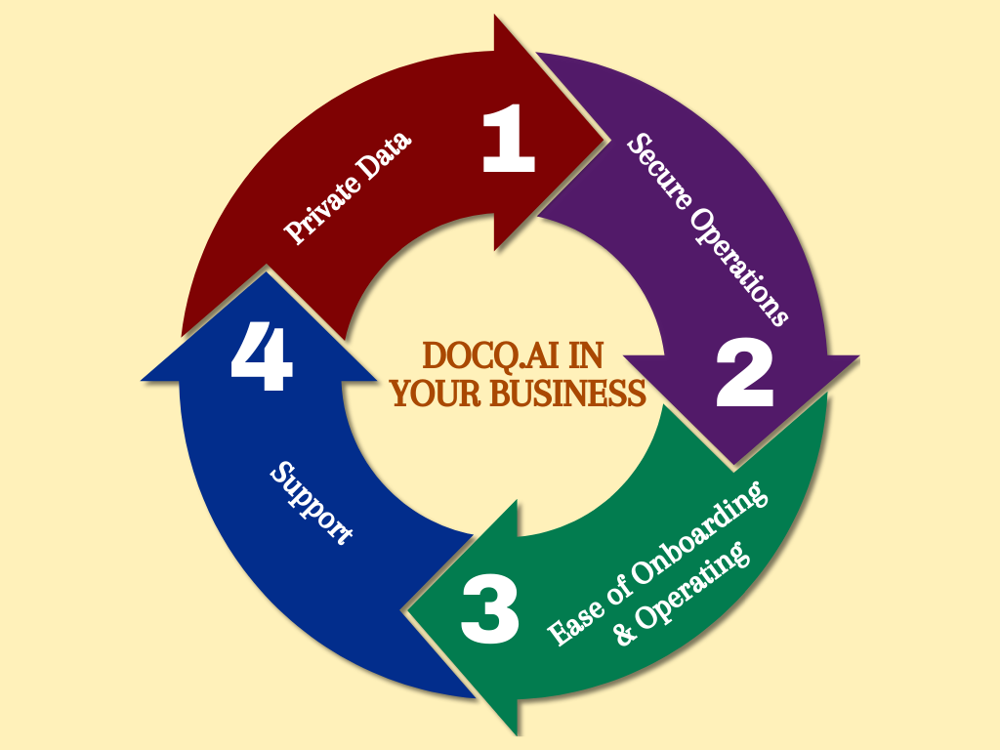

# Overview

Docq is an open-source software (OSS) helping _businesses_ gain **AI-based** _knowledge insight_ **privately** & **securely** using their _private, organisation data_.

In other words, Docq is your employees' private and secure ChatGPT that knows your business.

## Design Principles

### Business Use

Unlike many recent Software-as-a-Service (SaaS) offerings utilising the latest innovation in AI and Large Language Models (LLMs), Docq has the clear goal of helping businesses adopt AI from the very beginning.

In our view, this is as much of a technology challenge such as running the system privately and securely, but also an organisational challenge where businesses today have much to gain such as in productivity while at the same time, equally much to lose without careful planning.

To anticipate the challenges ahead, we think there are a few key ingredients for any solution to be successfully adopted:

- **Utilising private, organisational data**: There is untapped potential for any business with their operational knowledge encoded in the data.
- **Addressing data security and privacy concerns**: No business would send their customer details, revenue figures or even trade secrets to any un-vetted 3rd-parties; But this is exactly what could happen when an employee have uncontrolled access to AI products such as ChatGPT (and it has happened).
- **Justifying ROI quickly and clearly**: The latest innovation in AI/LLMs has caught worldwide attention and we agree that for businesses it has not only immediate use cases but also huge potential. The key for any software in the space in a business environment is to help smooth out the adoption curve.
- **Supporting in the long run**: We are only starting to see the potential of the technologies; Any software in commercial use should be developed with a long-term roadmap and supported by experts in the space.

### Private Data

Every business now accumulates knowledge by having all kinds of documents saved electronically within their IT infrastructure.
The challenge is how to discover insight from them in order to help businesses gain competitive edge, while avoiding any pitfalls for data security and privacy and/or addressing regulatory concerns.

This is the type of data Docq is designed to work with.

### Secure Access

With private, organisation data, access it securely becomes paramount.

In the age of AI/LLMs, there are many emerging 3rd-party vendors to choose from; However, it is also very easy to unknowingly leak data to these vendors without careful planning on how to adopt these technologies.

Docq is designed to encapsulate the best practices in data security, based on our experience in both AI/LLMs and IT/Cloud infrastructure to aid businesses in their adoption. It is secure by default when using Docq.

### Ease of Onboarding & Operating

It is important for any business to justify costs and benefits for the use of any new software. Docq is no exception and we put in great effort to design

- How a business could get started with Docq within minutes;
- How a business could continue operating Docq with minimal maintenance;
- And how any Docq user at a business could benefit from it instantly without length training.

All of these are reflected in Docq's user interface and user experience design.

### Commercially-friendly Licensing & Support

Last but not least, we release Docq under a licensing structure where any business could use it as-is free-of-charge. For situations where a business wants to have a commercial agreement with both licensing and support for Docq, we can make the arrangement accordingly.

## Key Features

### Multi-user Access

It is an integral part of any IT security policy to maintain data privacy, mitigate risks and ensure secure usage of any deployed software.
The benefits are also well known such as user authentication, authorisation, provisioning, and auditing. Docq supports all of these features in **Multi-user Access**.

What it also enables is collaboration. Combined with the following spaces feature, not only private data can be safeguarded against unauthorised access, it also facilitates data sharing securely.

### Spaces as Data Compartmentation

In businesses, it is a common practice to segregate and categorise data into separate compartments or units based on specific criteria.
The benefits are also well known such as for data security and governance, as well as regulatory compliance.

Another major benefit, which Docq utilises, is for collaboration and sharing. We introduce the concept of **Spaces**, combined with multi-user access as described previously, to make it not only possible, but also secure.

- In Docq, each user has their private space where documents can be uploaded and used as the ground truth for them to gain insight individually.
- At the same time, there can be a number of shared spaces controlled by the admin user who can also set up user permissions to each shared space.
- Each user can choose to include any shared space when asking questions in Docq, in order to discover more relevant insight from a wider range of documents permitted to be accessed by them.

### Familiar Chat User Interface

Chat, popularised by ChatGPT in recent times, has become the ubiquitous user interface. By adopting the same design, Docq flattens the learning curve for employees using it.

### Vendor-hosted and Self-hosted LLMs

As stated in the design principles above, Docq helps businesses control over how their private, organisational data is used when adopting AI/LLMs.

A typical, unchecked scenario is when using private data is to send some of it unknowingly to a 3rd-party AI vendor via their APIs. Over time, a dangerous amount of data would be built up on the vendor's side. They may or may not have data policy and agreement in place, compliant with your business's own requirements.

**Using vendor-hosted models such as Azure hosted OpenAI models, or self-hosted models such as those made available by HuggingFace, makes it much easier to consult with your cloud vendor and enforce your own data policy**.

Docq places high importance in supporting these two ways of utilising LLMs.

## Deployment Considerations

Docq is a self-hosted software which means **for data security and privacy reasons we, the Docq Team does NOT offer a hosted service** because we believe that the best place to operate Docq is within your existing cloud infrastructure setup.

It also lets a business adopting Docq operate exactly in the same way as they currently operate their IT infrastructure. You know best about your own operations.

Docq mainly caters for two deployment scenarios:

- **Secure Cloud Deployment**: For businesses that prefer to keep all their organisational data private, Docq can be deployed and configured to operate within an organisation's cloud account (i.e. network boundary) in order to guarantee that **no data is sent to any 3rd-party** intentionally or accidentally.
- **Flexible Cloud Deployment**: For businesses having less stringent requirements on their data and 3rd-party access, Docq can be
  - deployed in any major cloud infrastructure provider;
  - and configured to use any major 3rd-party AI/LLMs vendors via their APIs.

Plus

- **On-Premise Deployment**: It is another option and we are happy to support you with a bespoke setup.

Docq has been designed from ground up for the secure cloud and on-prem deployment scenarios with strict data security and privacy requirement in mind. However it should not stop all other businesses from adopting Docq with the flexible deployment setup if it suits their requirements.

### Secure Cloud Deployment

If your business have clear data security and privacy guideline, we recommend one of the big three cloud vendors:

- Microsoft Cloud (Azure)
- Amazon Web Services (AWS)
- Google Cloud Platform (GCP)

Do consult your chosen cloud vendor for compliance.

### Flexible Cloud Deployment

As an OSS product, Docq comes with source code that anybody could download and run anywhere in the world. Within each release, Docq offers Docker container images to be dropped into any container runtime. The choice is yours and it usually depends on your existing IT infrastructure.

The key configuration difference between _Secure_ and _Flexible_ deployments is **whether to allow 3rd-party LLMs access from Docq**, via these vendors' APIs. In a flexible deployment, it is up to you to decide the behaviour which may have implications on the compliance of your organisation's data security and privacy requirements.
