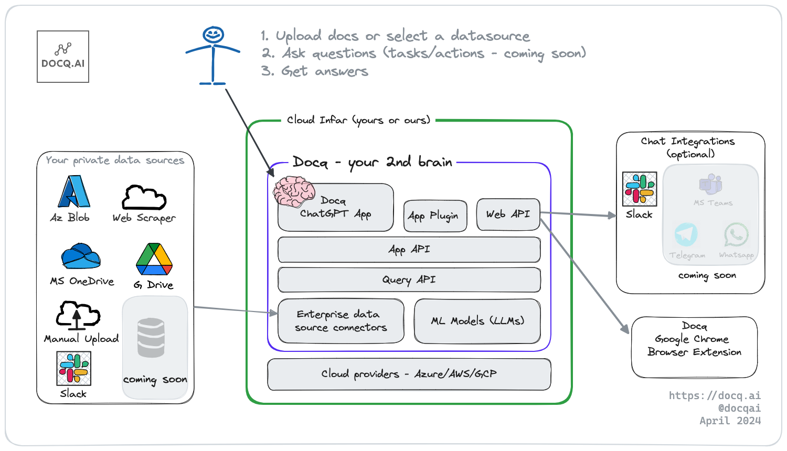

# Introduction

Docq helps your _**businesses**_ gain _**AI-based knowledge insight**_ from your _**private data, securely!**_

Think of Docq as **your employees' private and secure ChatGPT, a second-brain that understands your business**.

Docq is Open Source Software (OSS AGPLv3) that is self-hosted "on-premises" within your cloud provider account (Azure/AWS/GCP). That means all systems, including machine learning models and data, lives within your boundary of control.

For the developers and other tech-savvy audience, Docq is like **WordPress for generative AI**. Out-of-the-box you get a private ChatGPT and a platform that can be customised and built upon using a plugin system (see [extensions](./developer-guide/extensions.md)) and APIs (coming soon).

## Learn More

[Overview](./overview/introduction.md) - A high-level view of How Docq can help your business, design principles, key features, and different deployment scenarios.

[User Guide](./user-guide/getting-started.md) - This is section is for _end-users_ (employees) and admins of the Docq app. It covers how to deploy and config Docq and how to use the AI chat funcitonality to help with your daily work.

[Developer Guide](./developer-guide/getting-started.md) - This section id for those wanting to understand the Docq code base, make code changes to customise Docq, extend Docq, and use Docq as a platform to build AI powered applications on top.
