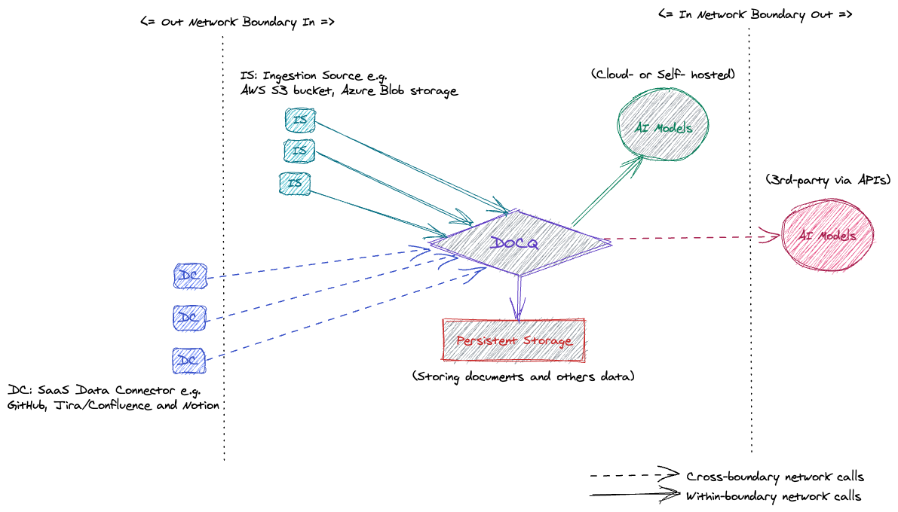

<!-- ## Deployment Scenarios -->

Docq is a **self-hosted, turnkey** software which means **for data security and privacy reasons we, the Docq Team does NOT offer a hosted service** because we believe that the best place to operate Docq is within your existing cloud infrastructure setup.

It also lets a business adopting Docq operate exactly in the same way as they currently operate their IT infrastructure. You know best about your own operations.

Docq mainly caters for two deployment scenarios:

- **Secure Cloud Deployment**: For businesses that prefer to keep all their organisational data private, Docq can be deployed and configured to operate within an organisation's cloud account (i.e. network boundary) in order to guarantee that **no data is sent to any 3rd-party** intentionally or accidentally.
- **Flexible Cloud Deployment**: For businesses having less stringent requirements on their data and 3rd-party access, Docq can be
  - deployed in any major cloud infrastructure provider;
  - and configured to use any major 3rd-party AI/LLMs vendors via their APIs.

Plus

- **On-Premise Deployment**: It is another option and we are happy to support you with a bespoke setup.

Docq has been designed from ground up for the secure cloud and on-prem deployment scenarios with strict data security and privacy requirement in mind. However it should not stop all other businesses from adopting Docq with the flexible deployment setup if it suits their requirements.

### Secure Cloud Deployment

If your business have clear data security and privacy guideline, we recommend one of the big three cloud vendors:

- Microsoft Cloud (Azure)
- Amazon Web Services (AWS)
- Google Cloud Platform (GCP)

Do consult your chosen cloud vendor for compliance.

### Flexible Cloud Deployment

As an OSS product, Docq comes with source code that anybody could download and run anywhere in the world. Within each release, Docq offers Docker container images to be dropped into any container runtime. The choice is yours and it usually depends on your existing IT infrastructure.

The key configuration difference between _Secure_ and _Flexible_ deployments is **whether to allow 3rd-party LLMs access from Docq**, via these vendors' APIs. In a flexible deployment, it is up to you to decide the behaviour which may have implications on the compliance of your organisation's data security and privacy requirements.
