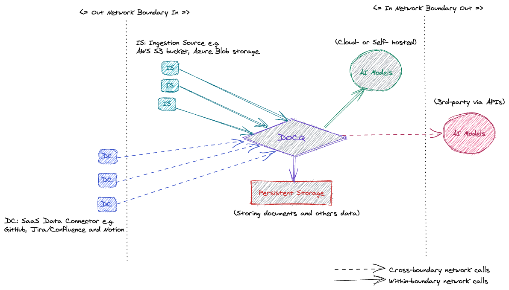

<!-- ## Deployment Scenarios -->
Docq can be deployed in several configurations trading off data isolation for operational convenience.

- **Isolated In Your Data centre**: Deploy on-prem on servers in your data centre. The most isolated hence most secure deployment. All your data stays within your data centre and enterprise network. LLMs will also have to be deployed on-premise to benefit from this option. We are happy to support you with a bespoke setup. **Bring LLMs to your data.**

- **Isolated In Your Cloud**: Deploy in your organisation's cloud account (Azure, AWS, GCP etc.). LLMs will need to be self-hosted in your cloud account. Similar to on-premise hosting, your data remains within network boundaries you control. **Bring LLMs to your data.**

- **Flexible In Your Cloud**: Docq is deployed in your cloud account similar to the _Secure Cloud Deployment_ option above. But it's configured to use a serverless LLM service provided by one of the major cloud providers such as Azure OpenAI, AWS Bedrock Claude, or GCP Vertex Gemini Pro. This is suitable for organisations with less sensitive data.

- **SaaS Dedicated** - Your own dedicated instance of Docq hosted and operated by us in a Azure account dedicated to you. Your instance doesn't share any infrastructure with other organisations.

- **SaaS Multi-tenant Standard** aka [app.docq.ai](https://app.docq.ai) - An instance of Docq hosted and operated in our cloud provider account (Azure UK South region). Each organisations data is isolated but you are sharing a single instance of Docq and LLMs. This is the fastest way to get started with Docq. Head over to [https://docq.ai/#plans](https://docq.ai/#plans) to subscribe.

Docq has been designed from ground up to be able to cater for the scenarios with the strictest data privacy and security requirements. This will require one of the isolated deployment options. If you are working with less sensitive data you can leverage one of the other deployment options to lower setup and operational costs.

The diagram above visualises some of the different deployment configurations.

- **Data ingestion**: across-boundary _SaaS data connectors_ versus within-boundary _data storage locations_
- **LLMs utilisation**: across-boundary models via _3rd-party APIs_ versus within-boundary _vendor-hosted & self-hosted_ models

### Secure Cloud Deployment

If your business have clear data security and privacy guidelines, we recommend one of the big three cloud vendors:

- Microsoft Cloud (Azure)
- Amazon Web Services (AWS)
- Google Cloud Platform (GCP)

Do consult your chosen cloud vendor for compliance.

We have infrastructure automation for Azure. We'll develop support for the others based on demand.

### Flexible Cloud Deployment

As an OSS product, Docq comes with source code that anybody could download and run anywhere in the world. Within each release, Docq offers Docker container images to be dropped into any container runtime. The choice is yours and it usually depends on your existing IT infrastructure.

The one requirement is to be able to mount a persistent drive into the container.

The key configuration difference between _Isolated_ and _Flexible_ deployments is **whether to allow Docq to use serverless LLMs hosted by cloud vendors or LLM providers them self**. In a flexible deployment, it is up to you to decide the behaviour which may have implications on the compliance of your organisation's data security and privacy requirements.