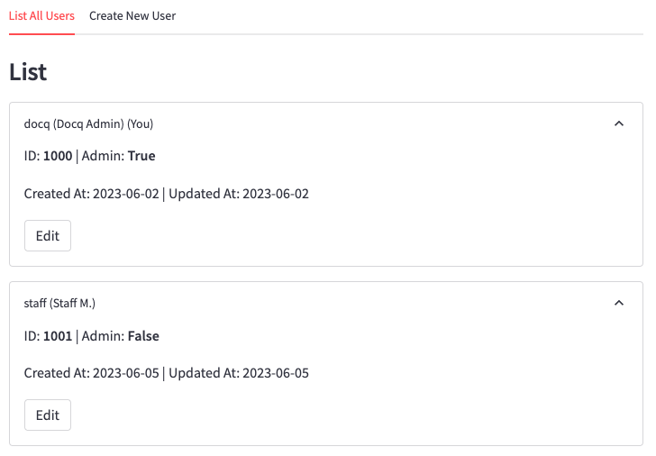
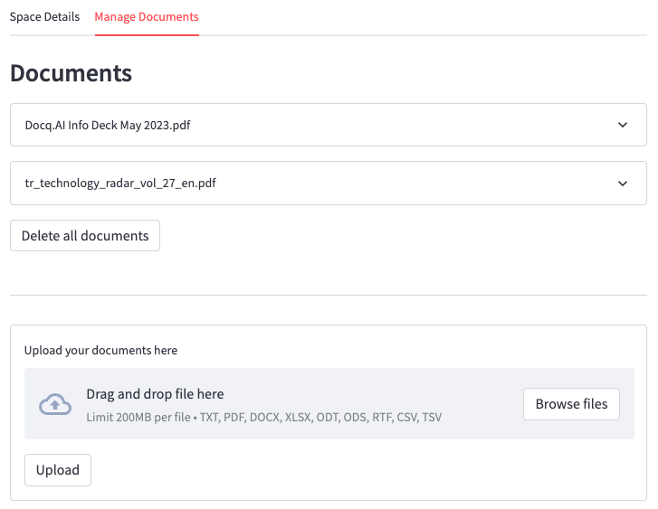
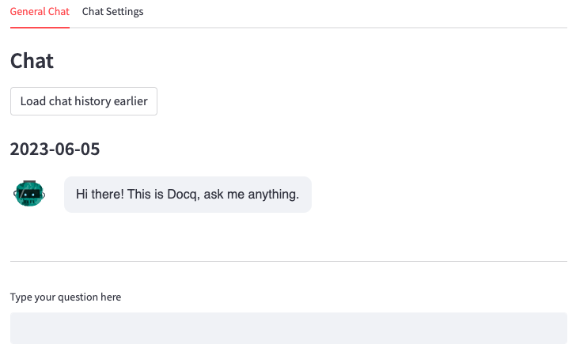
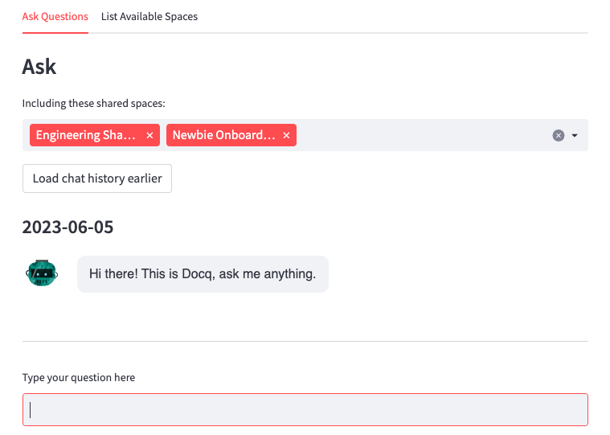

# Key Features

## Multi-user Access

It is an integral part of any IT security policy to maintain data privacy, mitigate risks and ensure secure usage of any deployed software.
The benefits are also well known such as user authentication, authorisation, provisioning, and auditing. Docq supports all of these features in **Multi-user Access**.

What it also enables is collaboration. Combined with the following spaces feature, not only private data can be safeguarded against unauthorised access, it also facilitates data sharing securely.

## Spaces as Data Compartmentation

In businesses, it is a common practice to segregate and categorise data into separate compartments or units based on specific criteria.
The benefits are also well known such as for data security and governance, as well as regulatory compliance.

Another major benefit, which Docq utilises, is for collaboration and sharing. We introduce the concept of **Spaces**, combined with multi-user access as described previously, to make it not only possible, but also secure.

- In Docq, each user has their private space where documents can be uploaded and used as the ground truth for them to gain insight individually.
- At the same time, there can be a number of shared spaces controlled by the admin user who can also set up user permissions to each shared space.
- Each user can choose to include any shared space when asking questions in Docq, in order to discover more relevant insight from a wider range of documents permitted to be accessed by them.

## Familiar Chat User Interface

Chat, popularised by ChatGPT in recent times, has become the ubiquitous user interface. By adopting the same design, Docq flattens the learning curve for employees using it.

Docq offers

- a general chat interface with secure access to a LLM.
  

- A chat interface to gain insight by combing one's own documents with those shared within an organisation.
  

## Vendor-hosted and Self-hosted LLMs

As stated in the design principles above, Docq helps businesses control over how their private, organisational data is used when adopting AI/LLMs.

A typical, unchecked scenario is when using private data is to send some of it unknowingly to a 3rd-party AI vendor via their APIs. Over time, a dangerous amount of data would be built up on the vendor's side. They may or may not have data policy and agreement in place, compliant with your business's own requirements.

**Using vendor-hosted models such as Azure hosted OpenAI models, or self-hosted models such as those made available by HuggingFace, makes it much easier to consult with your cloud vendor and enforce your own data policy**.

Docq places high importance in supporting these two ways of utilising LLMs.
