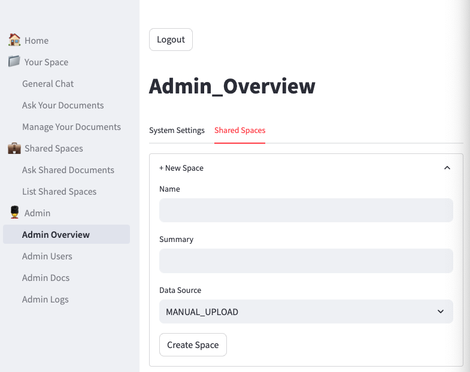
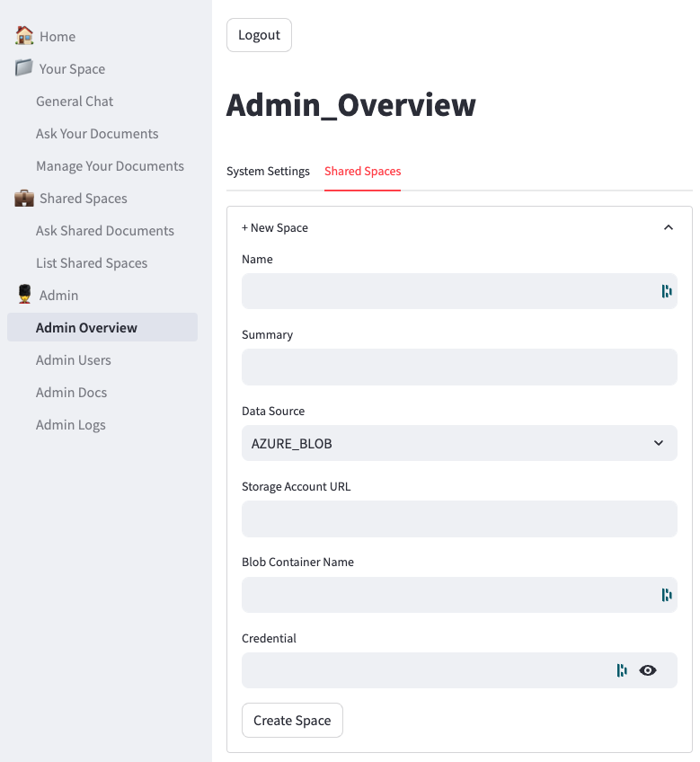
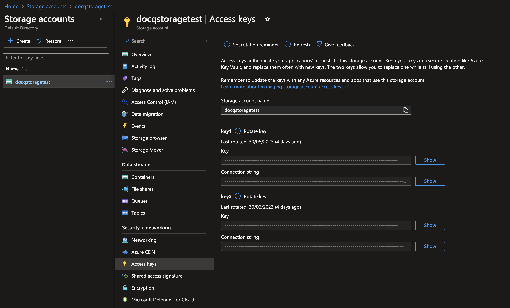
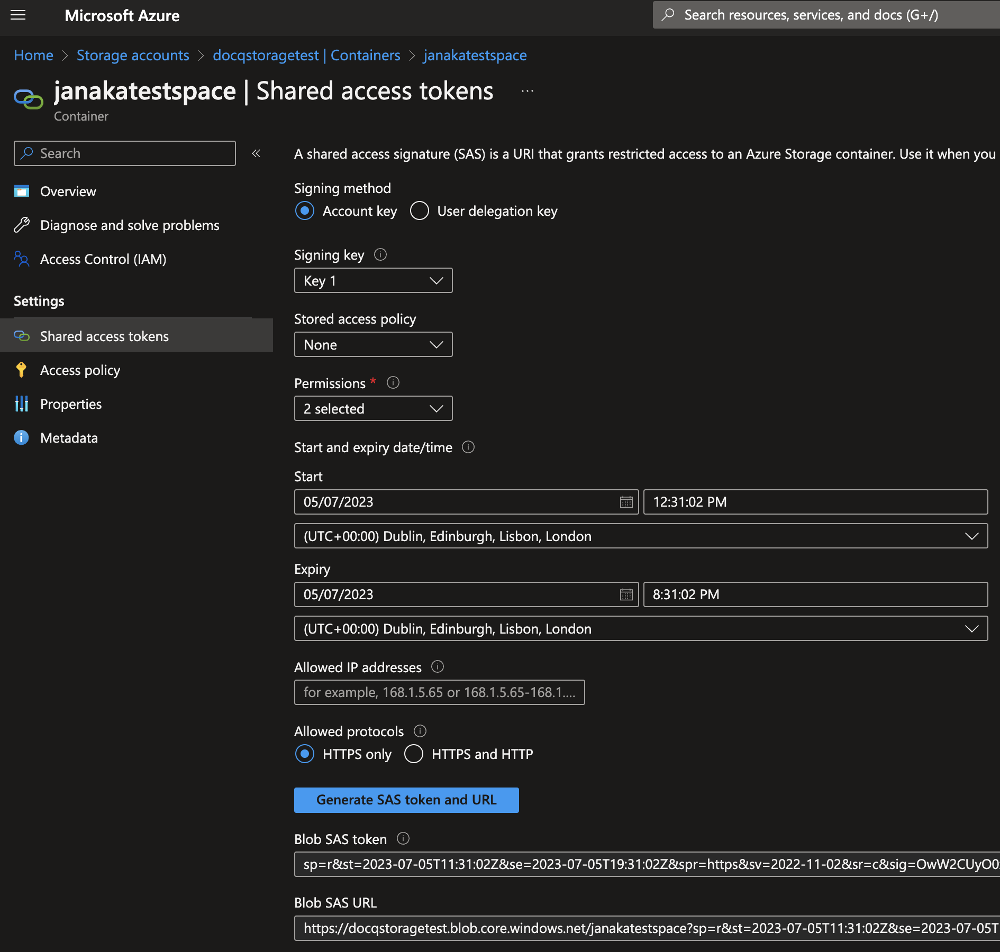

# Configure Spaces

A [Spaces](../overview/key-features.md#spaces-as-data-compartmentation) in Docq is associated with a single data source. Docq currently supports Azure blob containers. More data sources like AWS S3, Web scrapping, OneDrive, and G Drive. Let us know which data sources are most important to you, which will help us prioritise.

To create a space you need to have Admin previleges in Docq. 

- Navigate to 'Admin Overvew' > click the 'Shared Spaces' tab > click '+ New Space'
- Add a name that help you easily identify the space.
- Add a summary with any additional detials. This is helpful when managing several spaces.
- Finally select a data source. Most data sources will require additional config which is data source dependent. Each supported data source has a section below with configuration detials.
- Click 'Create Space' to complete.

At the moment, data sources other than MANUAL_UPLOAD require manually re-indexing by navigating to 'Manage Documents' and clicking the 'Reindex' botton.

## Data source: Azure Blob Container

Azure blob config screen in Docq

To get the values you will need access to the Azure portal where the Blob container is configured. If you don't have access you will need help from your friendly IT admin or cloud infrastructure engineer that does.

- Login to the Azure portal with a login that has sufficient access to view (or create) resources in the Azure Storage Acounts service. Blob containers live under a Storage Account.
- Navigate to 'Storage Accounts' then click on the stogre account with the blob container you want to link to Docq.

- **Data Source**: `AZURE_BLOB`
- **Storage Account URL**: `https://<Storage account name GOES HERE>.blob.core.windows.net` replace `<Storage account name GOES HERE>` with the value from the 'Storage account name' field in the Azure portal.
- **Blob Container Name**: paste the contianer name here. It's shown in Storage account > Containers in the Azure portal.
- **Credential** - there are two types supported values:
  - Access Key - This option gives broad accesss and might not be suitable in some situations. For exmaple if the storage account has other services and/or other containers with sensitive information.:
    - from the 'Access keys' section, key1 > Key > click the 'show' button then copy button > paste into Docq
  - Blob SAS Token - gives finer grained access:
    - click into the container > 'Shared access tokens'.
    - Set permissions to 'Read' and 'List'.
    - Set a sufficient Expiry date. When the token expires Docq will no longer be able to access the data and will throw an authentication error on relevant screens.
    - Click 'Generate SAS Token' and copy the value.
    - Leave the rest as default.
    - Click 'Generate SAS token and URL' > copypaste Blob SAS token into Docq
  
Storage account 'Access Keys' screen in the Azure portal:

Blob container 'Shared access tokens' screen in Azure portal:

## Data source: Website

Coming soon

## Data source: AWS S3

Coming soon
