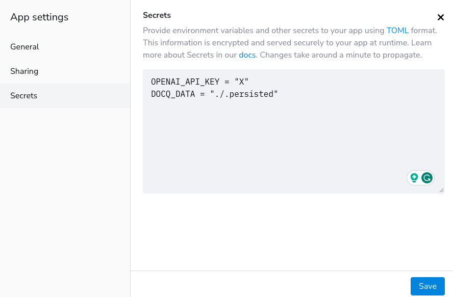

# Deploy to Streamlit: 5 Minutes and Flexible

In this deployment, you're going to utilise [Streamlit Community Cloud](https://streamlit.io/cloud) which is a free service offered by [Streamlit](https://streamlit.io), a subsidiary of [Snowflake](https://snowflake.com). We only recommend this method for demo purposes. Please don't use for production.

1. [Fork](https://github.com/docqai/docq/fork) the Docq repo at GitHub;
2. Follow the instructions on [Streamlit Community Cloud](https://streamlit.io/cloud) to create an app;
3. Once it's created, it should be listed as an app like below;
   
4. One last step is to find the _settings_ menu option and set _secrets_ which are environment variables required when running the application. An example is shown below.
   
5. Wait for a few minutes and go to the url of the new app to see it in action.