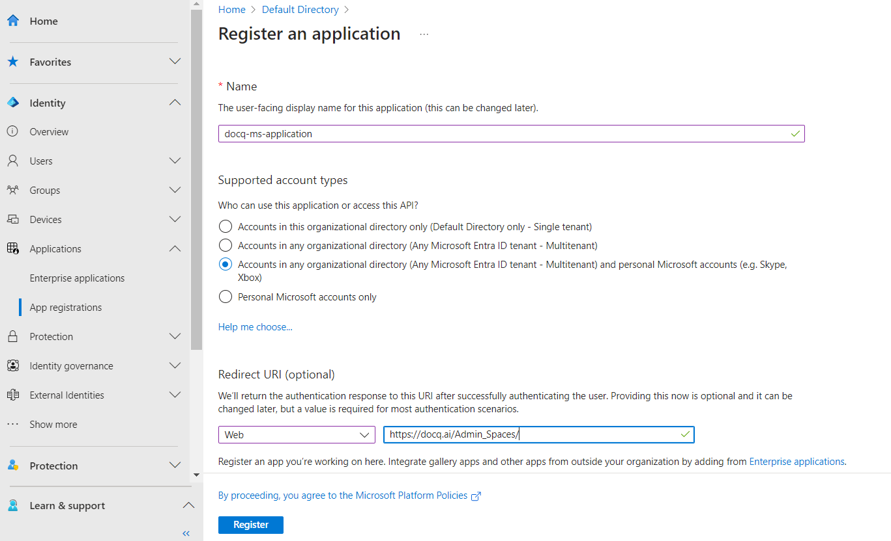

# File Storage Services

Docq supports multiple cloud file storage services as a data source. This section covers how to set up the supported file storage services.

## File storage: Google Drive

This guide aims to assist developers in integrating Google Drive with Docq. The focus will be on setting up the Google Drive API and obtaining the necessary credentials.

### Setup and Configure Google Cloud project

- [Create a Google Cloud project](https://console.cloud.google.com/projectcreate) for your Docq web application.
- [Enable the Google Drive API](https://console.cloud.google.com/flows/enableapi?apiid=drive.googleapis.com) in the project you just created.
- Go to Menu > APIs & Services > [OAuth consent screen](https://console.cloud.google.com/apis/credentials/consent) then click create and complete the App registration form with the following scopes:
  - `https://www.googleapis.com/auth/drive.readonly`
  - `https://www.googleapis.com/auth/userinfo.email`
  - `openid`
- Go to Menu > APIs & Services > [Credentials](https://console.cloud.google.com/apis/credentials) then click create credentials.
- Click `+ CREATE CREDENTIALS` > OAuth client ID then Fill the form with the following details:
  - Application type: Web application
  - Authorized redirect URIs: `/Admin_Spaces/`, e.g. `http://localhost:8501/Admin_Spaces/`
- Click create and download the credentials.json file.
  
The more detailed guide can be found [here](https://developers.google.com/drive/api/quickstart/python).
  
### Configure Docq web application for Google Drive

After setting up the Google Cloud project and configuring the Google Drive API, you need to configure the Docq web application. This involves configuring the following environment variables:

- `DOCQ_GOOGLE_APPLICATION_CREDENTIALS`: The path to the credentials.json file.
- `DOCQ_GOOGLE_AUTH_REDIRECT_URL`: The redirect URL, e.g. `http://localhost:8501/Admin_Spaces/`. This must be an exact match to the Authorized redirect URIs in the Google Cloud Console.

Note: The Google Drive data source will be automatically disabled if any of the above environment variables are not set.

## File storage: OneDrive

This guide aims to assist developers in integrating OneDrive with Docq. The focus will be on setting up the Microsoft Graph API and obtaining the necessary credentials.

### Setup and Configure Microsoft Azure Application

- [Register an Application](https://entra.microsoft.com/#view/Microsoft_AAD_RegisteredApps/CreateApplicationBlade/isMSAApp~/false) in the Microsoft Entra ID center

- Configure the following under `Redirect URI`
  - Select `Web` as the platform
  - Enter the redirect URL to the following path `/Admin_Spaces/` e.g. `http://localhost:8501/Admin_Spaces/`
- Select `API Permissions` on the side nav and add the following permissions
  - `Files.Read`
  - `User.Read`
  - `offline_access`
- Select `Certificates & secrets` on the side nav and create a new client secret and save this for later.
  
A more detailed guide can be found [here](https://learn.microsoft.com/en-us/graph/auth-register-app-v2#register-an-application).
  
### Configure Docq web application for OneDrive

After setting up the Microsoft Azure Application and configuring the Microsoft Graph API, you need to configure the Docq web application. This involves configuring the following environment variables:

- `DOCQ_MS_ONEDRIVE_CLIENT_ID`: The client ID of the application you registered in the Microsoft Azure Application.
- `DOCQ_MS_ONEDRIVE_CLIENT_SECRET`: The client secret of the application you registered in the Microsoft Azure Application.
- `DOCQ_MS_ONEDRIVE_REDIRECT_URI`: The redirect URL, e.g. `http://localhost:8501/Admin_Spaces/`. This must be an exact match to the Redirect URI in the Microsoft Azure Application.

Note: The OneDrive data source will be automatically disabled if any of the above environment variables are not set.
