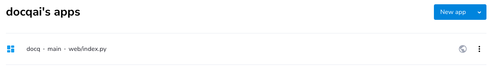

<!-- ## Getting Started -->

There are two main [deployment scenarios](../overview/deployment-scenarios.md) as stated in [Overview](../overview/introduction.md).

To get you started, we show you one example for each scenario below.

### Pre-requisites

- Make sure to study the [environment variables template file](../../misc/docker.env.template) in the repo to collect all the values for required environment variables.
- Take a note on the default username and password for the _admin_ user created when running the application for the first time.
  - username: `docq`
  - password: `Docq.AI`
- For Flexible Deployment, create a [Streamlit Community Cloud](https://streamlit.io/cloud) account.
- For Secure Deployment, create a [Microsoft Cloud / Azure](https://azure.microsoft.com/) account with a secure foundation.
- [Forking](https://github.com/docqai/docq/fork) the Docq repo at GitHub is highly recommended to have your own copy of code for your own deployment.

### In 5 Minutes with Flexible Deployment

In this deployment, you're going to utilise [Streamlit Community Cloud](https://streamlit.io/cloud) which is a free service offered by [Streamlit](https://streamlit.io), a subsidiary of [Snowflake](https://snowflake.com).

1. [Fork](https://github.com/docqai/docq/fork) the Docq repo at GitHub;
2. Follow the instructions on [Streamlit Community Cloud](https://streamlit.io/cloud) to create an app;
3. Once it's created, it should be listed as an app like below;
   
4. One last step is to find the _settings_ menu option and set _secrets_ which are environment variables required when running the application. An example is shown below.
   
5. Wait for a few minutes and go to the url of the new app to see it in action.

### In 15 Minutes with Secure Deployment

In this deployment, you're going to utilise [Microsoft Cloud / Azure](https://azure.microsoft.com/) which is Microsoft's cloud offering trusted by many organisations.

1. [Fork](https://github.com/docqai/docq/fork) the Docq repo at GitHub;
2. Click the [Deploy to Azure](https://portal.azure.com/#create/Microsoft.Template/uri/https%3A%2F%2Fraw.githubusercontent.com%2Fdocqai%2Fdocq%2Fmain%2Fdeploy%2Fazure%2Fappservice.json) button to start the configuration wizard on Azure;
   
3. Once all the parameters are filled in and validated, Azure will start provisioning;
4. Wait for 5-10 minutes for it to finish and go to the url of the new app to see it in action.

### After Getting Started

Firstly, please change the default password for the _admin_ user as your first task after login.

Then use this installation as a blueprint for your production deployment, which may require more thorough planning and preparation.

Please refer to [Installation](./installation.md) and [Configuration](./configuration.md) for details.
