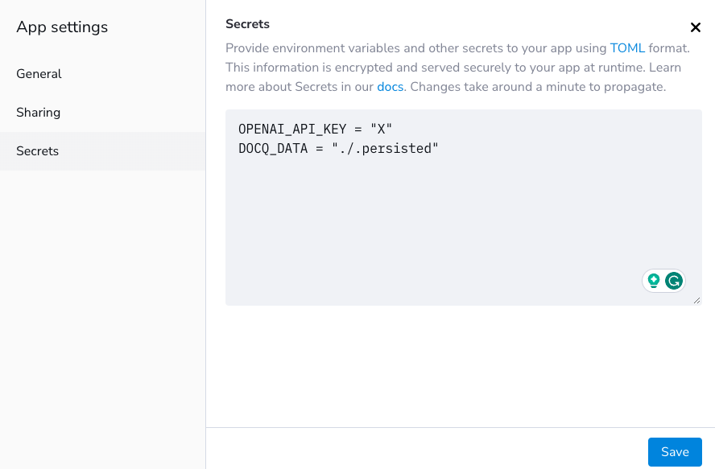

<!-- ## Getting Started -->

There are two main [deployment scenarios](../overview/deployment-scenarios.md) as stated in [Overview](../overview/introduction.md).

To get you started, we show you one example for each scenario below.

### Pre-requisites

- Make sure to study the [environment variables template file](../../misc/docker.env.template) in the repo to collect all the values for required environment variables.
- Take a note on the default username and password for the _admin_ user created when running the application for the first time. Changing the password for this account will be the first thing you do after deploying this app.
  - username: `docq`
  - password: `Docq.AI`
- For Flexible Deployment, create a [Streamlit Community Cloud](https://streamlit.io/cloud) account.
- For Secure Deployment, create a [Microsoft Cloud / Azure](https://azure.microsoft.com/) account with a secure foundation.
- [Forking](https://github.com/docqai/docq/fork) the Docq repo at GitHub is highly recommended to have your own copy of code for your own deployment.

### Deploy to Streamlit: 5 Minutes and Flexible

In this deployment, you're going to utilise [Streamlit Community Cloud](https://streamlit.io/cloud) which is a free service offered by [Streamlit](https://streamlit.io), a subsidiary of [Snowflake](https://snowflake.com). We only recommend this method for demo purposes. Please don't use for production.

1. [Fork](https://github.com/docqai/docq/fork) the Docq repo at GitHub;
2. Follow the instructions on [Streamlit Community Cloud](https://streamlit.io/cloud) to create an app;
3. Once it's created, it should be listed as an app like below;
   
4. One last step is to find the _settings_ menu option and set _secrets_ which are environment variables required when running the application. An example is shown below.
   
5. Wait for a few minutes and go to the url of the new app to see it in action.

### Deploy to Azure: 15 Minutes and Secure

In this deployment, you're going to utilise [Microsoft Cloud / Azure](https://azure.microsoft.com/) which is Microsoft's cloud offering trusted by many organisations.

1. [Fork](https://github.com/docqai/docq/fork) the Docq repo at GitHub;
2. Click this  button to start the configuration wizard on Azure.
   
3. Resource group: create a new one by clicking the 'Create new' link next to the Resource Group label.
4. Region: select your preferred region. `East US` or `West Europe` are recommended because of LLM support.
5. Leave all the remaining parameters values as default unless you encounter a resource naming clash.
6. Click 'Next: Reveiw + create'. Azure will validate the template + parameter values. You should see 'Validation Passed'.
7. Click 'Create' to initiate resouece deployment. It will take 5-10mins. A successful deployment looks like the following.
   
8. Click on the 'Outputs' left menu option to grab the URL to the Docq web app you just deployed.

### Deploy to AWS: 15 Mintutes and Secure

Coming soon

### Deploy to GCP: 15 Mintutes and Secure

Coming soon

### After Getting Started

Firstly, please change the default password for the _admin_ user as your first task after login.

Then use this installation as a blueprint for your production deployment, which may require more thorough planning and preparation. We are considering providing production ready Infra-as-Code (CDK for Terraform or Terraform HCL). Let us know if this would be valuable.

Please refer to [Installation](./installation.md) and [Configuration](./configuration.md) for details.
